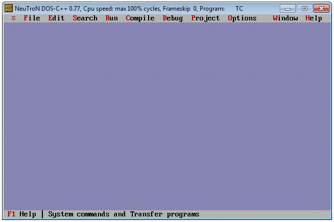
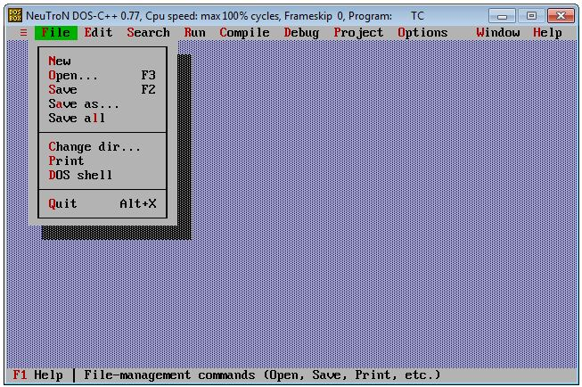
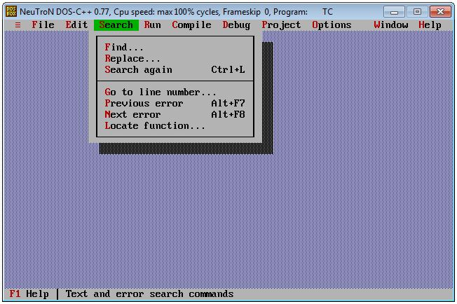
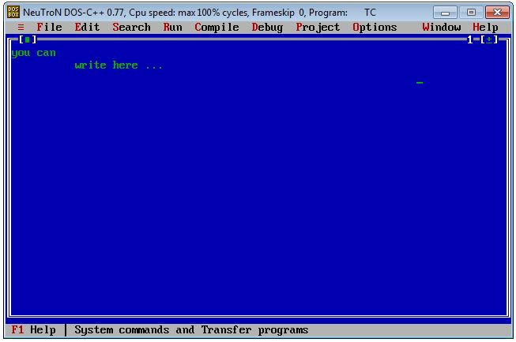
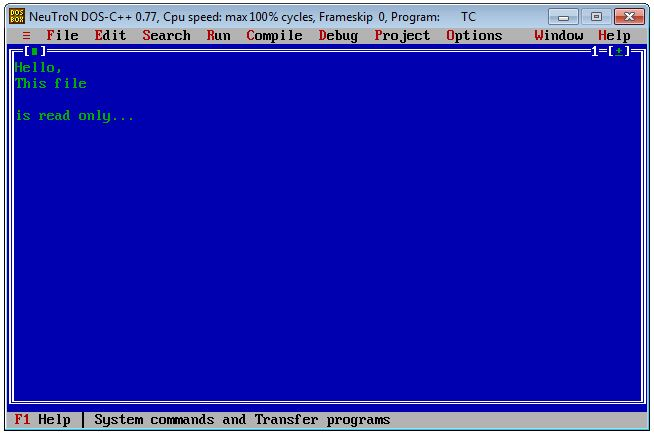

# :computer: BORLAND TEXT EDITOR :computer:

Borland  Text  Editor  is  the  simple  text  editor  which  graphical  representation  is same as BORLAND C Compiler. (Borland C Compiler is made under GNU-General Public Licence so it is available to modify or use without prior information to its author). Editor  gives  you  the  feel  of old Borlandcompiler  with  its original contents.You can writeand read from the specific files.

*This program is tested using Borland C++ Compiler.*

## File Structure
| File Name | Description |
| --- | --- |
| APP.CPP | main application |
| INCLUDE.CPP | includes declaration and definitions |
| GRAPHIC.CPP | graphic functions |
| MENU.CPP |    menu manipulation functions |
| WINDOW.CPP |  window manipulation functions |

## Screenshots
### Application
> Main Application Window

### Menus
> File Menu

> Search Menu

### Editor Window
> New File Window

> Open File Window

